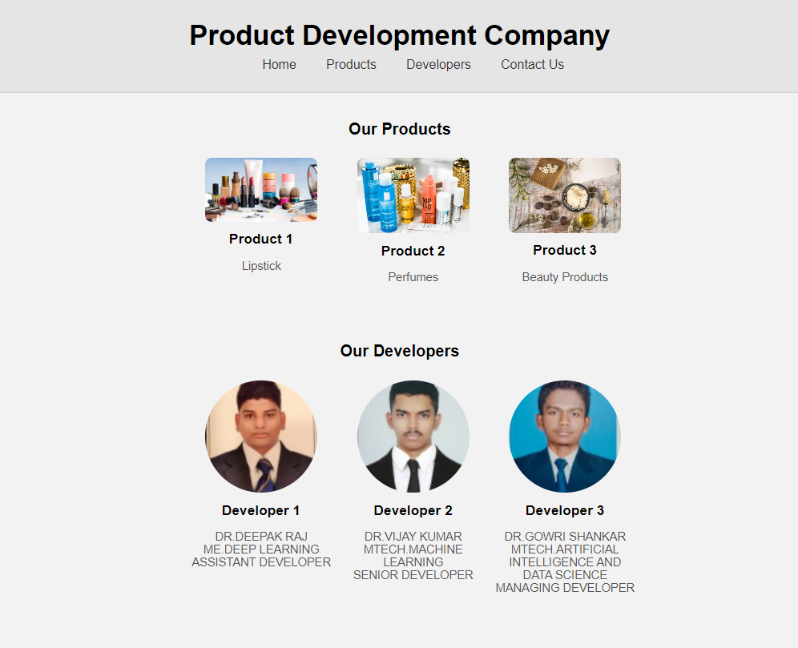

# Web Design for a Software Product Company

## AIM:

To design a static website for a software product company company.

## DESIGN STEPS:

### Step 1:

Requirement collection.

### Step 2:

Creating the layout using HTML and CSS.

### Step 3:

Updating the sample content.

### Step 4:

Choose the appropriate style and color scheme.

### Step 5:

Validate the layout in various browsers.

### Step 6:

Validate the HTML code.

### Step 6:

Publish the website in the given URL.

## PROGRAM :
```
<!DOCTYPE html>
<html>
<head>
	<title>Product Development Company</title>
	<style type="text/css">
		body {
			background-color: #f2f2f2;
			font-family: sans-serif;
			margin: 0;
		}

		.container {
			max-width: 1200px;
			margin: 0 auto;
		}

		header {
			background-color: #e5e5e5;
			padding: 20px 0;
			border-bottom: 1px solid #d3d3d3;
			text-align: center;
		}

		.logo {
			margin-top: 10px;
			font-size: 2.6em;
			font-weight: bold;
		}

		.menu {
			background-color: #e5e5e5;
			padding: 10px 0;
			text-align: center;
		}

		.menu ul {
			list-style: none;
			margin: 0;
			padding: 0;
		}

		.menu ul li {
			display: inline-block;
			margin-left: 40px;
		}

		.menu ul li a {
			text-decoration: none;
			color: #333;
			font-size: 1.2em;
		}

		.products {
			background-color: #f2f2f2;
			padding: 20px 0;
			text-align: center;
		}

		.products-list {
			margin: 0 auto;
			max-width: 700px;
			display: flex;
			flex-wrap: wrap;
			justify-content: space-evenly;
		}

		.products-list li {
			list-style: none;
			width: 30%;
			margin: 10px 0;
			text-align: center;
		}

		.products-list img {
			width: 80%;
			border-radius: 10px;
		}

		.products-list h3 {
			font-size: 1.3em;
			margin: 10px 0;
		}

		.products-list p {
			font-size: 1.1em;
			color: #555;
		}

		.developers {
			background-color: #f2f2f2;
			padding: 20px 0;
			text-align: center;
		}

		.developers-list {
			margin: 0 auto;
			max-width: 700px;
			display: flex;
			flex-wrap: wrap;
			justify-content: space-evenly;
		}

		.developers-list li {
			list-style: none;
			width: 30%;
			margin: 10px 0;
			text-align: center;
		}

		.developers-list img {
			width: 80%;
			border-radius: 50%;
		}

		.developers-list h3 {
			font-size: 1.3em;
			margin: 10px 0;
		}

		.developers-list p {
			font-size: 1.1em;
			color: #555;
		}
	</style>
</head>
<body>
	<div class="container">
		<header>
			<div class="logo">Product Development Company</div>
			<nav class="menu">
				<ul>
					<li><a href="#">Home</a></li>
					<li><a href="#">Products</a></li>
					<li><a href="#">Developers</a></li>
					<li><a href="#">Contact Us</a></li>
				</ul>
			</nav>
		</header>
		<section class="products">
			<h1>Our Products</h1>
			<ul class="products-list">
				<li>
					
					<h3>Product 1</h3>
					<p>Lipstick</p>
				</li>
				<li>
					
					<h3>Product 2</h3>
					<p>Perfumes</p>
				</li>
				<li>
					
					<h3>Product 3</h3>
					<p>Beauty Products</p>
				</li>
			</ul>
		</section>
		<section class="developers">
			<h1>Our Developers</h1>
			<ul class="developers-list">
				<li>
					
					<h3>Developer 1</h3>
					<p>DR.DEEPAK RAJ ME.DEEP LEARNING<br>ASSISTANT DEVELOPER</p>
				</li>
				<li>
					
					<h3>Developer 2</h3>
					<p>DR.VIJAY KUMAR MTECH.MACHINE LEARNING<br>SENIOR DEVELOPER</p>
				</li>
				<li>
					
					<h3>Developer 3</h3>
					<p>DR.GOWRI SHANKAR MTECH.ARTIFICIAL INTELLIGENCE AND DATA SCIENCE<br>MANAGING DEVELOPER</p>
				</li>
			</ul>
		</section>
	</div>
</body>
</html>
```

## OUTPUT:

### Home Page:


## Result:

Thus a website is designed for the software product company and the HTML,CSS code are validated.
